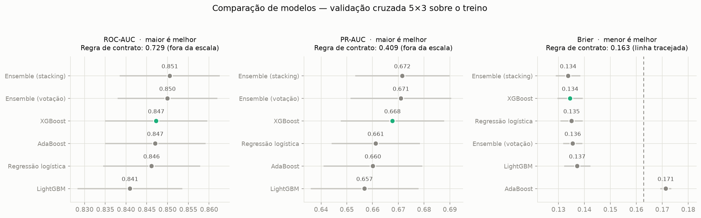
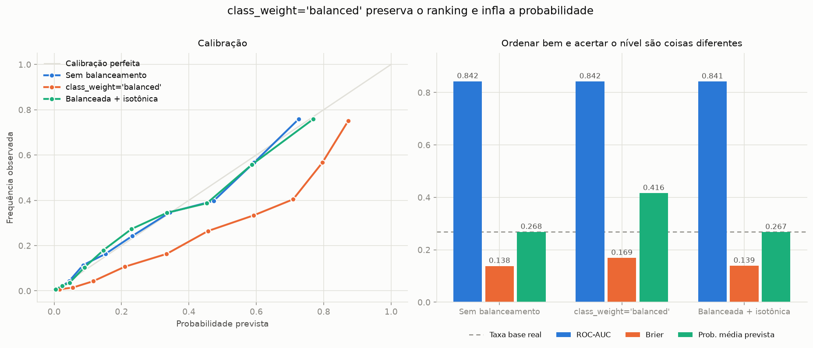

# telco-churn

Previsão de cancelamento (churn) de clientes de telecomunicações, com uma camada de decisão que traduz probabilidade em recomendação de campanha, e um dashboard público.

> ⚠️ **Projeto em construção.** Hoje o repositório tem a análise exploratória, o pacote de treino e a comparação de modelos. A camada de decisão e o dashboard entram nas fases seguintes — o roteiro está em [Estado do projeto](#estado-do-projeto). Este README será reescrito quando o dashboard estiver no ar.

## O problema

Uma operadora com 7.043 clientes perde 26,5% deles. Um time de retenção não consegue — nem deveria — ligar para todo mundo: cada contato tem custo, e a maior parte dos clientes não ia cancelar de qualquer forma. A pergunta útil não é *"quem vai cancelar?"* e sim **"para quantos clientes vale a pena ligar, e para quais?"**.

É por isso que o projeto não termina no modelo. Um ROC-AUC não diz quantas pessoas contatar. A entrega final é um limiar de decisão derivado de valor esperado — custo da oferta contra receita preservada — e um dashboard onde os parâmetros de negócio são ajustáveis, porque eles são suposições e devem ser tratados como tal.

## Achados preliminares da EDA

Já demonstrados no notebook, contra uma taxa base de **26,5%**:

- **Contrato é o sinal dominante.** Mês a mês: 42,7% · Um ano: 11,3% · Dois anos: 2,8%.
- **O churn se concentra no começo da vida do cliente.** Tenure mediano de 10 meses entre quem cancela, contra 38 entre quem fica.
- **Fibra ótica cancela mais que DSL** (41,9% vs 19,0%) — e a explicação óbvia, preço, **não se sustenta**: dentro da fibra, quanto mais caro o plano, *menor* o churn (55,7% no quartil barato → 26,3% no caro). O que a mensalidade baixa marca é cliente novo, sem serviços adicionais e sem fidelidade. Controlando contrato e tempo de casa, ainda sobram **28 pontos** de diferença (70,2% vs 42,5%) que a base não explica — não há nenhuma coluna de qualidade de serviço, suporte ou concorrência. Fica como pergunta aberta, não como causa presumida.
- **`TotalCharges` é redundante.** É reconstituível a partir de `tenure × MonthlyCharges` — a mediana do resíduo é exatamente 0,00. A ablação da fase de modelagem confirmou: remover a variável custa no máximo 0,0018 de ROC-AUC, menos de 0,15 desvio entre folds.

Os cinco achados completos estão em [`01_eda_telco.ipynb`](notebooks/01_eda_telco.ipynb).

## Modelagem

Sete modelos comparados por validação cruzada 5×3 sobre o treino, com o conjunto de teste medido uma única vez no fim. A narrativa está em [`02_modelagem.ipynb`](notebooks/02_modelagem.ipynb); o registro de **todas** as decisões, com a razão de cada uma, em [Procedimentos e decisões da fase de modelagem](docs/procedimentos-e-decisoes-da-fase-de-modelagem.md).



**O modelo bate o baseline com folga, e os modelos aprendidos empatam entre si.** A regra de uma linha (`Contract == "Month-to-month"`) faz ROC-AUC 0,729 e PR-AUC 0,409; os seis modelos aprendidos ficam entre 0,841–0,851 e 0,657–0,672, com barras de erro que se sobrepõem quase inteiramente.

**A comparação pareada é o que separa sinal de ruído.** A variação entre folds (±0,019 de PR-AUC) é o dobro da diferença entre modelos (~0,010), então comparar médias afoga tudo. Mas os folds são compartilhados — um fold difícil é difícil para todos —, e a diferença *dentro* de cada fold cancela essa variação comum. Aí o sinal aparece: os ensembles vencem a regressão logística em **15/15** e **14/15** folds. LightGBM e AdaBoost, ao contrário, não a superam.

**Campeão: XGBoost**, por uma regra de desempate declarada em código — entre os modelos que empatam com o líder, fica o mais barato de treinar. O stacking lidera por 0,0005 de PR-AUC e custa **37× mais** por ajuste.

| Modelo | ROC-AUC | PR-AUC | Brier | s/ajuste |
|---|---|---|---|---|
| Regra de contrato | 0,729 | 0,409 | 0,163 | 0,00 |
| Regressão logística | 0,846 | 0,661 | 0,135 | 0,02 |
| AdaBoost | 0,847 | 0,660 | **0,171** | 0,70 |
| **XGBoost** (campeão) | 0,847 | 0,668 | 0,134 | 0,24 |
| LightGBM | 0,841 | 0,657 | 0,137 | 0,61 |
| Ensemble (votação) | 0,850 | 0,671 | 0,136 | 1,53 |
| Ensemble (stacking) | 0,851 | 0,672 | 0,134 | 8,77 |

*Validação cruzada 5×3 sobre o treino. No teste, o campeão faz ROC-AUC 0,845 · PR-AUC 0,664 · Brier 0,136.*

### A armadilha da calibração



Com 26,5% de positivos, o reflexo comum é `class_weight="balanced"`. Ele preserva o ranking e **destrói o nível da probabilidade**: a média prevista sobe de 0,268 para **0,416**, contra uma taxa base real de 0,265 — superestima o risco em mais de 50% —, e o Brier vai de 0,138 para 0,169.

O ROC-AUC não denuncia nada disso (0,8424 → 0,8418). Um projeto que reportasse só AUC entregaria à camada de decisão um modelo que infla o valor esperado de toda campanha. Como o valor esperado usa o **valor absoluto** de `p_churn` e não o ranking, essa distinção não é acadêmica — e é por isso que o modelo de produção vai sem balanceamento.

O **AdaBoost é o contraexemplo útil do projeto**: ROC-AUC competitivo (0,847) e o pior Brier da escada (0,171), pior que o de uma regra de uma linha. Ele ordena bem e mente sobre o nível.

### O que a operação enxerga

No primeiro decil de risco o lift é **2,89**. Contatando os dois primeiros decis — **282 clientes, 20% da base** — a campanha alcança **51% de todos os cancelamentos**; a regra de contrato, no mesmo orçamento, alcança 30%.

## Dados

[Telco Customer Churn](https://www.kaggle.com/datasets/blastchar/telco-customer-churn) — distribuído no Kaggle por *blastchar*, originalmente um conjunto de amostra da IBM. 7.043 clientes, 21 colunas, rótulo `Churn` já pronto.

O arquivo está versionado neste repositório (977 KB) de propósito: é o que permite clonar e rodar o notebook do início ao fim sem nenhum passo manual de download. **Os dados são dos autores originais** — a licença MIT deste repositório cobre apenas o código.

## Como rodar

```bash
git clone https://github.com/pedroateixeira/telco-churn.git
```

```bash
cd telco-churn && uv sync && uv run jupyter lab
```

Para treinar o modelo do zero, ou refazer a comparação e as figuras:

```bash
uv run python -m telco_churn.treinar
```

```bash
uv run python -m telco_churn.comparacao
```

Requer [uv](https://docs.astral.sh/uv/) e Python 3.12. No macOS, os boosters precisam do OpenMP: `brew install libomp`. O `uv sync` lê o `uv.lock` e reproduz exatamente as mesmas versões de biblioteca usadas aqui.

## O que é cada arquivo

### Existe hoje

| Caminho | Para que serve |
|---|---|
| `notebooks/01_eda_telco.ipynb` | Análise exploratória: tratamento dos dados justificado passo a passo, taxa base, análise univariada, checagem de categorias raras, churn por categoria contra a base, relação com as numéricas e a refutação da hipótese de preço da fibra. |
| `src/telco_churn/treinar.py` | Ponto de entrada: um comando treina do zero e salva o artefato. Lê o campeão de `comparacao.json` em vez de trazê-lo escrito no código. |
| `notebooks/02_modelagem.ipynb` | A narrativa da modelagem. Lê os artefatos gravados em vez de retreinar, para que texto e números não possam divergir. |
| `docs/procedimentos-e-decisoes-da-fase-de-modelagem.md` | Todas as decisões da modelagem com a razão de cada uma, as alternativas descartadas e o que **não** foi feito. É onde se defende a escolha, não onde se mostra o número. |
| `models/comparacao.json`, `reports/figures/*.png` | Saída da comparação: tabelas, lift por modelo e as sete figuras. Versionados para o README não exibir gráfico quebrado. |
| `src/telco_churn/dados.py` | Carregar, validar o schema e aplicar o tratamento que no notebook está espalhado pelas células. Falha alto se uma coluna esperada sumir, e confere o contrato que `features.py` assume. |
| `src/telco_churn/features.py` | O `ColumnTransformer`: codificação de categóricas e escala, ajustados **só** no conjunto de treino. |
| `src/telco_churn/modelo.py` | Split, montagem do `Pipeline`, avaliação (ROC-AUC, PR-AUC, Brier), validação cruzada repetida, curva de calibração, lift por decil, e o baseline `RegraContrato`. |
| `src/telco_churn/catalogo.py` | Os sete modelos comparados, como *fábricas* — cada fold treina do zero, e reusar a mesma instância vazaria estado entre folds. |
| `src/telco_churn/comparacao.py` | Roda a escada, a ablação e o experimento de calibração; grava `models/comparacao.json` e as figuras. É quem decide o campeão. |
| `src/telco_churn/graficos.py` | As figuras de comparação. Recebem dados prontos e devolvem `Figure` — não treinam nem salvam, para poderem ser reusadas no dashboard. |

| `data/raw/telco_customer_churn.csv` | O dataset original, sem nenhuma alteração. Nada neste projeto escreve nesta pasta: dado bruto é imutável, e essa separação é o que garante que a análise seja refazível do zero. |
| `data/processed/` | Destino dos dados já tratados, gerados pelo pipeline. Vazio no Git de propósito (ver `.gitignore`) — conteúdo derivado se regenera, não se versiona. |
| `pyproject.toml` | Declara o projeto e suas dependências (pandas, scikit-learn, XGBoost, LightGBM, Streamlit) em faixas de versão, mais um grupo `dev` com pytest e ruff. Também guarda a configuração do ruff e do pytest, para não espalhar arquivo de config pela raiz. |
| `uv.lock` | Trava as versões **exatas** de todas as dependências, incluindo as transitivas. É a diferença entre "instalei as bibliotecas" e "outra pessoa consegue reproduzir o meu resultado". Versionado sempre. |
| `.python-version` | Fixa o Python em 3.12. O `uv` lê este arquivo e baixa a versão certa sozinho se ela não existir na máquina. |
| `.gitignore` | Mantém fora do Git o ambiente virtual, caches, checkpoints do Jupyter e dados derivados. Tem duas exceções deliberadas e comentadas no próprio arquivo: o CSV bruto e o `models/modelo.joblib` **são** versionados — o primeiro para o notebook rodar em máquina limpa, o segundo porque o Streamlit Cloud precisa do modelo dentro do repositório. |
| `LICENSE` | MIT. Cobre o código deste repositório, não o dataset. |
| `models/modelo.joblib`, `models/metricas.json` | O modelo de produção (XGBoost) e o relatório do treino — métricas, lift, ambiente que o produziu e as colunas de entrada. |
| `*/.gitkeep` | Arquivos vazios que existem por uma limitação do Git: ele não versiona diretório vazio. Sem eles, a estrutura de pastas não sobreviveria ao clone. |

### Entra nas próximas fases

| Caminho | Para que vai servir |
|---|---|
| `src/telco_churn/decisao.py` | A camada de valor esperado: limiar ótimo por custo, curva orçamento × lucro, análise de sensibilidade. |
| `app/streamlit_app.py` | O dashboard: segmentos de risco, simulador individual e simulação de campanha. |
| `tests/` | pytest para o que quebra em silêncio: validação de schema, ausência de vazamento no pipeline, corretude do limiar. |
| `.github/workflows/ci.yml` | Roda ruff e pytest a cada push. |
| `requirements.txt` | Gerado a partir do `uv.lock` só para o deploy — o Streamlit Community Cloud lê este formato. |

## Estado do projeto

- [x] **Fase 0** — Repositório, ambiente reprodutível e licença
- [x] **Fase 1** — EDA fechada, com os cinco achados
- [x] **Fase 2** — Do notebook ao pacote `src/`
- [x] **Fase 3** — Modelagem: escada de sete modelos, ablação e calibração
- [ ] **Fase 4** — Camada de decisão por valor esperado
- [ ] **Fase 5** — Dashboard Streamlit
- [ ] **Fase 6** — Testes e integração contínua
- [ ] **Fase 7** — README final e deploy público

## Decisões e limitações

- **Sem split temporal.** O dataset não tem nenhuma coluna de data — `tenure` é duração, não data de entrada do cliente. Isso torna impossível separar treino e teste por safra, que seria o correto. A consequência: a performance medida é otimista em relação ao que se veria em produção. Fica declarado.
- **Nem toda ferramenta cabe aqui.** 7.043 linhas não justificam Spark nem um data warehouse. Forçar ferramenta grande em dado pequeno é ruído de currículo, não engenharia — a escalada de ferramenta fica para o projeto seguinte, sobre uma base que realmente não cabe em memória.
